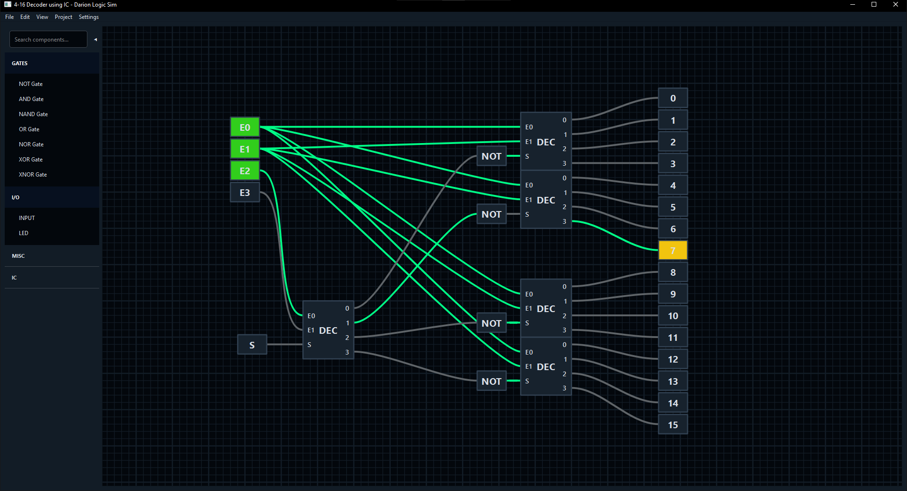

# Darion Logic Sim

Darion Logic Sim is a Python-based digital logic simulator featuring a PySide6 visual editor and a dual-backend simulation architecture built with Cython. It is designed to be highly interactive, visually stunning, and parallel to real-life simulation, allowing the user to practice Logic Design skills with ease of use.



## Features

- Extremely fast circuit simulation using precompiled Cython backend.
- Very accurate to real-life circuit behavior, as it accounts for propagation delay and self-oscillations.
- Minimal but powerful and customizable user interface.
- Circuit building experience is made to be as smooth and unobtrusive as possible with QoL features.
- For wiring components, pin-to-pin approach is used instead of manual path-drawing for a smoother design experience. Created wires will path-find to maintain a clean layout without clutter.
- Simulation speed can be controlled to view and diagnose circuit propagation in great detail.
- Projects can be converted and reused as integrated circuits (IC) to build large complex systems.
- Runs locally without any the need of internet connection.
- Cross-platform compatibility.

---

## Build Instructions

**1. Create and activate a Python virtual environment:**

```bash
# Linux / macOS
python -m venv env
source env/bin/activate

# Windows
python -m venv env
env\Scripts\activate.bat
```

**2. Install dependencies:**

```bash
pip install pyside6 setuptools cython psutil orjson
```

**3. Build the Cython Reactor (Optional):** The pure Python engine runs out of the box. The high-performance Reactor requires C++ compilation via Cython.

```bash
# Linux / macOS
bash scripts/build.sh

# Windows
scripts\build.bat
```


#### Usage

**Run the Simulator with GUI:**

```bash
python main.py
```

**Command Line Interface (CLI):** Run the simulator in a headless state. Upon starting, you can select which backend to use.

```bash
python interface/CLI.py
```

---

## Structure

## I. Language and Backend Choice

**Python vs. Cython**

Python is a very easy language to work with and has versatile library support. However, it is a dynamically typed language that uses an interpreter. Interpreters are inherently slow, and Python's Object-Oriented Programming (OOP) relies completely on references. Because objects are scattered across memory (RAM), they must be fetched from random locations. This memory fragmentation is a major reason why Python is a poor choice when performance is a priority.

Cython, on the other hand, allows the use of compiled code alongside the interpreter. To run at native C++ speeds, the code must be "Python-proof"—written with C/C++ style and data types. Properly written code is crucial for Cython to reach its full potential; it must be completely free from Pythonic objects. Using Pythonic objects in the backend triggers the Global Interpreter Lock (GIL), which entirely negates the performance benefits of the compiled code.

## II. Core Optimizations and Data-Oriented Design

**Array of Structures (AOS) & Memory Management**

To achieve maximum performance, the reactor backend utilizes Data-Oriented Design through an Array of Structures (AOS) approach. A special C++ struct was created to hold data related to propagation and connections, acting as an addition to the standard Python gate.

This approach provides three major structural advantages:

1. **Memory Locality:** Retrieving data from specific, contiguous places in memory (arrays and structs) is significantly faster than fetching it from random locations. The CPU actively tries to keep this array in its cache, aggressively boosting simulation speeds at high scales.
    
2. **Topological Compilation:** By topologically sorting the array using a modified Kahn's algorithm, the memory locations of the gates' data chunks can be manipulated. Gates are aligned in memory such that high speeds are maintained even if the circuit's size far exceeds the CPU's cache limit.
    
3. **Unique Identification:** The array naturally creates a unique ID (the array index) for every gate. This ID is used directly to dictate gates across UI updates, serialization, and propagation.
    

This backend is designed to compete with the simulation speeds of Verilog. It can handle multiple input toggles and simulate an entire circuit in a single array traversal. (Note: The UX aspect of this feature is still under construction and is currently only used to transition from design mode to simulate mode effectively optimizing it without disturbing the user).

## III. Circuit Evaluation and Simulation Engine

**Memorization and Forward Evaluation**

A special book array is used to store the states of inputs. If a gate changes its output, it directly modifies this array. Propositional and quantifier logic is heavily utilized to ensure **O(1) evaluation**, regardless of the input size, without needing to check the states of other gate inputs. Certain components, such as NOT gates and buffer gates, bypass the book array entirely and operate directly on the state of their inputs.

**Clocks and Discrete Event Simulation**

Variables or inputs are converted into clocks, utilizing the book array to store and control delays. The simulator uses a dedicated `Task` object that wraps gates (or gate locations) into delayed tasks, which execute when their time is up.

The entire system relies on a priority queue for artificial timing, mirroring real-world nanosecond delays. The discrete event simulation system allows users to tweak timing at precise values, modifying clock pulses to solve race conditions.

**Real-World Glitches & Delays**

Every gate adds its own propagation delay relative to its input. This accurately showcases real-world glitches, helping users design circuits while remaining fully aware of the hardware consequences of their design choices.

- _Example (CSE-2104 Project):_ When building an asynchronous mod-10 counter with reset pins, a known physical glitch causes the circuit to reset to 4 instead of 0. Another glitch briefly displays the intermediate value of 10—or (1010)2—which shouldn't visually persist. Our simulator is the only one capable of showcasing these specific hardware issues beforehand. Users can fix these simulated race conditions natively by adding buffer gates to introduce extra propagation delay.
    

**Oscillations**

Handling oscillations was one of the most complex challenges. While simulators like Logisim simply count up to a static limit before throwing a warning (which is inefficient), this simulator uses a dynamic counter to detect oscillations much earlier. It propagates the simulation in batches so the system can display the oscillation to the user without hanging or crashing.
The dynamic counter works on the theory of maximum depth, propagation occurs in waves so the maximum amount of wave(depth) is the total number of gates + 1, which can be understood by imagining a chain of not gates and then also a xor-gate connected to itself(the +1 comes from this).

## IV. System Architecture and Integration

**UI Decoupling**

The UI is built entirely in Python, while the propagation function is strictly built in Cython (and must remain free of Python objects). To bridge this, a parallel array of UI elements is created, referencing the `location` attribute (the array index). These act as currencies between the frontend and backend.

During simulation, UI updates occur in between clock pulses. After propagation, indices are loaded into a deque accessed by the UI, which updates the elements asynchronously. This decoupling is achieved using parallel location integers and special intermediate functions that act as an API for the UI. _(Note: Updating the UI only between clock pulses may swallow some unstable signals or oscillations if a gate changes state multiple times between two pulses)._

**IC Deserialization**

Integrated Circuit (IC) creation is designed to be minimal and nearly indistinguishable from a standard circuit. It strictly stores input pins, output pins, internal gates, and a full internal connection map. External pins are short-circuited, behaving like buffer gates visible to the UI. During propagation, the "IC" entity does not exist as a separate overhead layer.

During IC creation, a Breadth-First Search (BFS) traversal is performed to remove unnecessary internal gates and extra pins. For example, if four 1-bit full adders are connected to create a 4-bit full adder, all redundant internal pins from the unit ICs are removed. Only the strictly necessary external I/O pins remain, vastly reducing the size and entity cost of the final IC.

## Credits

- This project was developed and submitted as part of the Software Development course for our Bachelor's degree in Computer Science & Engineering.
- Thank you [Logisim](http://www.cburch.com/logisim/) for inspiring this project.

---

## License

This project is licensed under the GNU General Public License v3.0 - see the [LICENSE](LICENSE) file for details.
